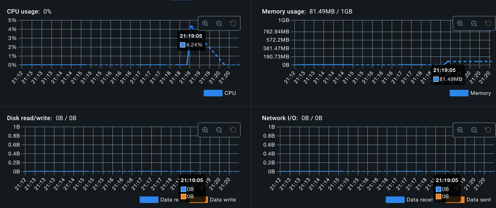

# Go vs Dotnet

## Introduction

cs-demo: **Use** .net8 **Version:** 8.0.8 **Framework:** .NetCore

go-demo: **Use** golang **Version** 1.23.0 **Framework:** Gin Gonic

## Test Performance

Run Api

### Start service โดยไม่ได้ทำการเรียกใช้
**cs-demo**

**go-demo**

### Run 15 ครั้ง delay แต่ละครั้ง 500ms
**cs-demo**
- /cpu/1000000000

**go-demo**
- /cpu/1000000000

### Run 15 ครั้ง delay แต่ละครั้ง 500ms
**cs-demo**
- /memory/10000000

**go-demo**
- /memory/10000000

## Reference
- https://github.com/antonputra/tutorials